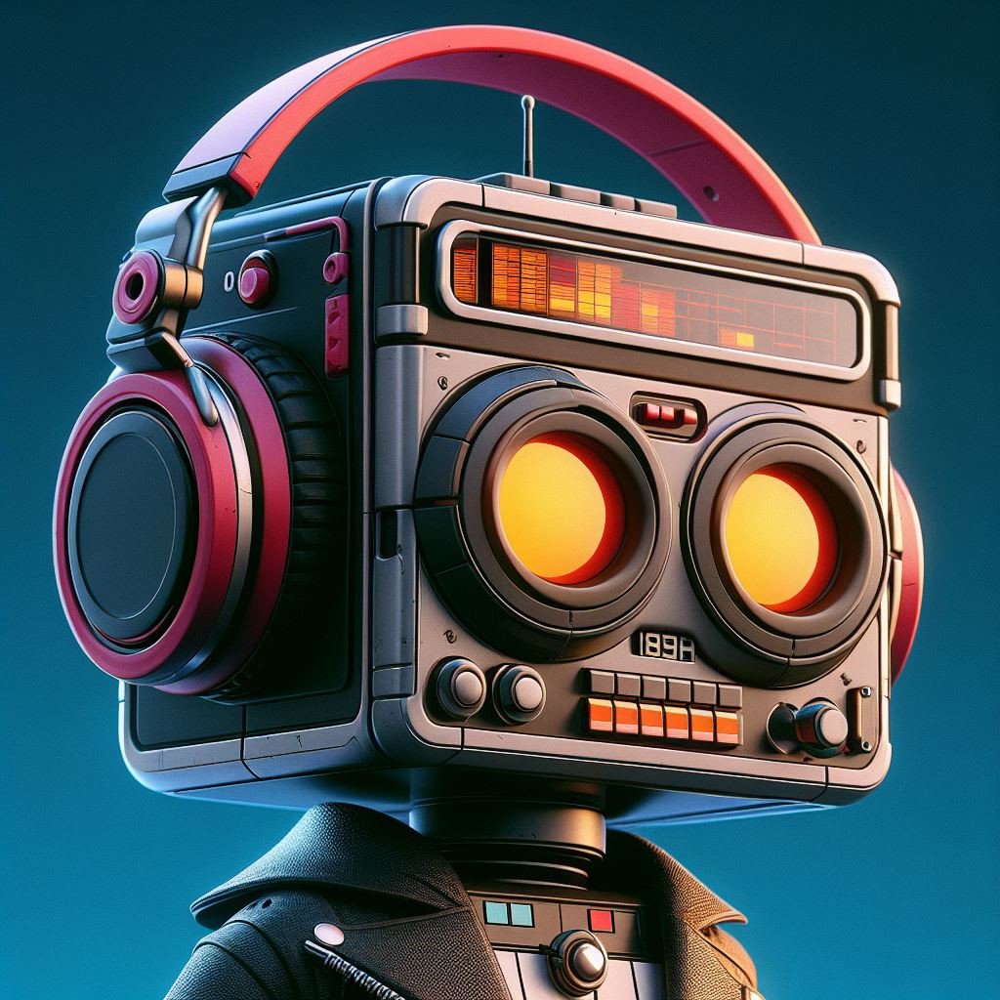

<div align="center">
  <table>
    <tr>
      <td>
        
      </td>
      <td>
        <div align="left">
          <h1>JukeBot</h1>
          <h3>A Discord music bot at your commands.</h3>
        </div>
      </td>
    </tr>
  </table>
</div>

---

- [Description](#description)
- [Commands](#commands)
- [Dependencies](#dependencies)
- [Getting started](#getting-started)


## Description
JukeBot is a simple yet effective Discord music bot.

It is made with [discord.py](https://discordpy.readthedocs.io/en/stable/) and it uses [youtube](https://pypi.org/project/pytubefix/) to add new songs.

## Commands

The bot has two categories of commands:

**Admin**:
- `join`    Join a voice channel.
- `leave`   Leave the voice channel.

**Music**:
- `add`     Add a song to the playlist.
- `play`    Play music.
- `pause`   Pause music.
- `resume`  Resume music.
- `stop`    Stop music.
- `loop`    Toggle song loop.
- `next`    Go to the next song.
- `prev`    Go to the previous song.
- `list`    Show available playlists.
- `show`    Show current playlist songs.
- `switch`  Switch playlist.
- `shuffle` Shuffle playlist songs.
- `move`    Move songs in the playlist.
- `remove`  Remove a song from the playlist.
- `clear`   Clear playlist.
- `delete`  Delete a song or a playlist.

## Dependencies

Before getting started, make sure you have created your [Discord app](https://discord.com/developers/docs/quick-start/getting-started#step-1-creating-an-app) and you got your token to set it in the `.env` file.

Also make sure to have the other variables set in the `.env` file.

## Getting started

To make it work, place in the base project folder and type:

```sh
make up
```
